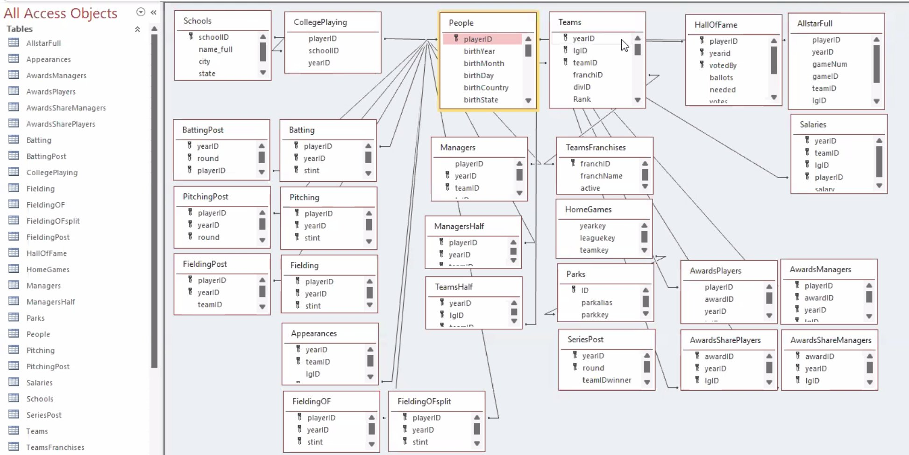

Workshop 5
================
YH
2024-02-13

- [Baseball statistics](#baseball-statistics)
- [Global fishing watch from
  BigQuery](#global-fishing-watch-from-bigquery)

## Baseball statistics

In the first workshop, we continue working on the `Lahman` data sets on
baseball players. Here’s the database schema, retrieved from the [Sean
Lahman’s Baseball
Database](https://github.com/cdalzell/Lahman?tab=readme-ov-file).



- Let’s load the necessary packages first.

``` r
# install.packages("pacman")
pacman::p_load(tidyverse, # tidyverse packages
               dbplyr,    # database with dplyr
               DBI,       # Database interface
               RSQLite,   # SQLite package for R
               bigrquery, # Google BigQuery
               Lahman)    # toy data
# Create and connect to an SQLite database
lite_con <- DBI::dbConnect(RSQLite::SQLite(), ":memory:")
```

- We will be using the following tables: `people`, `collegePlaying`, and
  `schools`.

``` r
# Copy local data frames to remote database
copy_to(
  dest = lite_con, 
  df = Lahman::People, 
  name = "people",
  temporary = FALSE, 
  indexes = list("playerID")
)
people_db <- tbl(lite_con, "people")

copy_to(
  dest = lite_con, 
  df = Lahman::CollegePlaying, 
  name = "collegeplaying",
  temporary = FALSE, 
  indexes = list("playerID")
)
collegeplaying_db <- tbl(lite_con, "collegeplaying")

copy_to(
  dest = lite_con, 
  df = Lahman::Schools, 
  name = "schools",
  temporary = FALSE, 
  indexes = list("schoolID")
)
schools_db <- tbl(lite_con, "schools")
```

``` r
# Show available tables
dbListTables(lite_con)
```

    ## [1] "collegeplaying" "people"         "schools"        "sqlite_stat1"  
    ## [5] "sqlite_stat4"

### 1. Find all players with first name as “Ken” or “Matty”.

``` sql
/* 1. Find all players with first name as "Ken" or "Matty" */
SELECT playerID, nameFirst, nameLast, birthYear
FROM people
WHERE namefirst IN ("Ken", "Matty")
```

<div class="knitsql-table">

| playerID  | nameFirst | nameLast   | birthYear |
|:----------|:----------|:-----------|----------:|
| alouma01  | Matty     | Alou       |      1938 |
| ashke01   | Ken       | Ash        |      1901 |
| asproke01 | Ken       | Aspromonte |      1931 |
| berryke01 | Ken       | Berry      |      1941 |
| bosweke01 | Ken       | Boswell    |      1946 |
| boyerke01 | Ken       | Boyer      |      1931 |
| brettke01 | Ken       | Brett      |      1948 |
| brondke01 | Ken       | Brondell   |      1921 |
| burkhke01 | Ken       | Burkhart   |      1916 |
| caminke01 | Ken       | Caminiti   |      1963 |

Displaying records 1 - 10

</div>

### 2. Find all players whose first name contains “mat”. Then show the unique first names that contain “mat”.

``` sql
/* 2.1 Show unique first names that contain "mat" */
SELECT playerID, nameFirst, nameLast, birthYear
FROM people
WHERE namefirst LIKE "%mat%"
```

<div class="knitsql-table">

| playerID  | nameFirst | nameLast  | birthYear |
|:----------|:----------|:----------|----------:|
| adamsma01 | Matt      | Adams     |      1988 |
| alberma01 | Matt      | Albers    |      1983 |
| alexama01 | Matt      | Alexander |      1947 |
| alouma01  | Matty     | Alou      |      1938 |
| anderma01 | Matt      | Anderson  |      1976 |
| andrima01 | Matt      | Andriese  |      1989 |
| anglema01 | Matt      | Angle     |      1985 |
| antonma01 | Matt      | Antonelli |      1985 |
| barnema01 | Matt      | Barnes    |      1990 |
| battema01 | Matthew   | Batten    |      1995 |

Displaying records 1 - 10

</div>

``` sql
/* 2.2 Show unique first names with "mat" */
SELECT DISTINCT nameFirst AS Num
FROM people
WHERE namefirst LIKE "%mat%"
```

<div class="knitsql-table">

| Num     |
|:--------|
| Matt    |
| Matty   |
| Matthew |
| Matias  |
| Mat     |

5 records

</div>

### 3. Find all players born in Alaska (AK) or Hawaii (HI) after the year of 1980. Order the result by birth year.

``` sql
/* 3. Count all players who were born in AK or HI after 1980 */
/* Order results by birthYear */
SELECT nameFirst, nameLast, birthYear, birthState, birthCountry
FROM people
WHERE birthState in ("AK", "HI") AND birthYear >= 1980
ORDER BY birthYear
```

<div class="knitsql-table">

| nameFirst | nameLast  | birthYear | birthState | birthCountry |
|:----------|:----------|----------:|:-----------|:-------------|
| Chad      | Bentz     |      1980 | AK         | USA          |
| Shane     | Komine    |      1980 | HI         | USA          |
| Shane     | Victorino |      1980 | HI         | USA          |
| Chad      | Santos    |      1981 | HI         | USA          |
| Jerome    | Williams  |      1981 | HI         | USA          |
| Tony      | Barnette  |      1983 | AK         | USA          |
| Scott     | Feldman   |      1983 | HI         | USA          |
| Bronson   | Sardinha  |      1983 | HI         | USA          |
| Kurt      | Suzuki    |      1983 | HI         | USA          |
| Kila      | Ka’aihue  |      1984 | HI         | USA          |

Displaying records 1 - 10

</div>

### 4. Players in the database can attend more than one colleges. Find the last college attended by each player.

``` sql
/* 4. Find the last college attended by each player */
SELECT people.playerID, nameGiven, yearID, collegeplaying.schoolID, name_full
FROM people
LEFT JOIN collegeplaying
  ON people.playerID = collegeplaying.playerID
LEFT JOIN schools
  ON collegeplaying.schoolID = schools.schoolID
GROUP BY people.playerID
HAVING yearID == max(YearID)
```

<div class="knitsql-table">

| playerID  | nameGiven          | yearID | schoolID   | name_full                              |
|:----------|:-------------------|-------:|:-----------|:---------------------------------------|
| aardsda01 | David Allan        |   2003 | rice       | Rice University                        |
| abadan01  | Fausto Andres      |   1993 | gamiddl    | Middle Georgia College                 |
| abbeybe01 | Bert Wood          |   1892 | vermont    | University of Vermont                  |
| abbotje01 | Jeffrey William    |   1994 | kentucky   | University of Kentucky                 |
| abbotji01 | James Anthony      |   1988 | michigan   | University of Michigan                 |
| abbotky01 | Lawrence Kyle      |   1989 | longbeach  | California State University Long Beach |
| abercre01 | Reginald Damascus  |   2000 | flgateway  | Florida Gateway College                |
| abernte01 | Talmadge Lafayette |   1941 | elon       | Elon University                        |
| ablesha01 | Harry Terrell      |   1904 | swesterntx | Southwestern University                |
| accarje01 | Jeremiah Lee       |   2003 | illinoisst | Illinois State University              |

Displaying records 1 - 10

</div>

### 5. Count the number of unique players that attended Rice University.

``` sql
/* 4. Count the number of unique players that attended Rice University */
SELECT COUNT(DISTINCT people.playerID)
FROM people
LEFT JOIN collegeplaying
  ON people.playerID = collegeplaying.playerID
WHERE schoolID = "rice"
```

<div class="knitsql-table">

| COUNT(DISTINCT people.playerID) |
|--------------------------------:|
|                              33 |

1 records

</div>

- Once we are done using a database, make sure to **disconnect** from
  the connection.

``` r
DBI::dbDisconnect(lite_con)
```

## Global fishing watch from BigQuery

In the second workshop, we will work on data from the Global Fishing
Watch (GFW) project.
